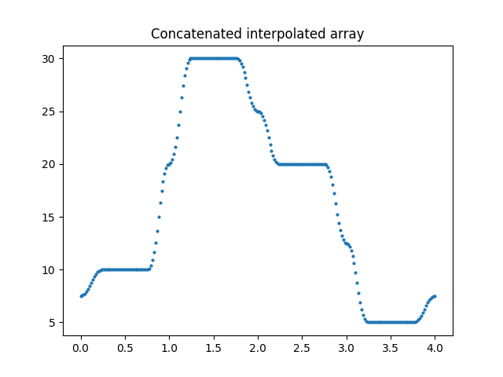

file:///home/matthieu/Documents/dotblocks/dotb_case_study/results/diffusion_2D/T.gif

# dotb_case_study
Centralized implementation of time marching methods dedicated to equations of type :

∂y(x, t)/∂t = F (y, x, t)

where y is a tensor field and F a generic function.

Three solvers :
- Euler explicit
- Adams Bashforth
- Crank Nicolson

have been implemented to run on three study cases :
- rabbit population dynamics
- ballistic equation
- 2D diffusion problem

# Installation :
Pull the git repo :
https://github.com/Matthieudese78/dotb_case_study.git

In the root directory (dotb_case_study) do :
```
pip install .
```

# Running input.yaml scripts
Three defaults input scripts are given in the root directory. Run them with :
```
python main.py input.yaml
```
Or as a module from outside the root directory :
#### first run
```
python setup.py install
```
#### then
```
python -m dotb_case_study.main input_file.yaml
```

Three example of configuration .yaml files are given in the root repository. Each one can be run with the three solvers.

In the absence of an input file as argument, a default 2D diffusion case will be launched.

# Non-declarative usage :
Alternatively, a demo script "demo_diffusion.py" is available in the root directory for non-declarative data setting.

# Results
Figures are saved  in the save_dir directory given in the input.yaml.

# Features
- A refined mesh class Mesh enables to refine the mesh locally at the borders and corners of the domain to avoid convergence difficulties.


- For the 2D diffusion case, it is possible to smoothly interpolate the boundary conditions at the corners. The parameter : 'interpolation_coeff' represents the percentage of the edges length on which the interpolation takes place.



# Architecture :
Three classes of solvers (module solver.py)
- EulerExplicit
- AdamsBashforth
- CrankNicolson

They take one of the three following equation right hand side classes as argument (module second_member.py):

- Ballistic
- Rabbit
- Diffusion

They are assembled in the build_model.py module in the function create_model. The mapping Solver - Study Case happens through a dictionary defined in the same module.

## Add a new solver / study case :
This way, adding a new study case consists in two steps :

- crate a class in second_member.py that contains three methods :
  - the right hand side of the equation F
  - the newton raphson for the Crank Nicolson (form of the residual derivative etc..)
  - the boundary conditions function (identity if none)
- Add the class name in the solver-to-case mapping dictionary in build_model.py

Conversely, adding a new solver consists in two steps :
- Code the general structure of the solver by adding a class in the solver.py module,
- Add the class name in the solver-to-case mapping dictionary in build_model.py


For larger solver or case study catalogues, it could be considered to create parent classes Solver and CaseStudy to fix and control the structure of the children classes.

# Tests
To do...
# Documentation
To do...

# Demo jupyter notebook
To do...
